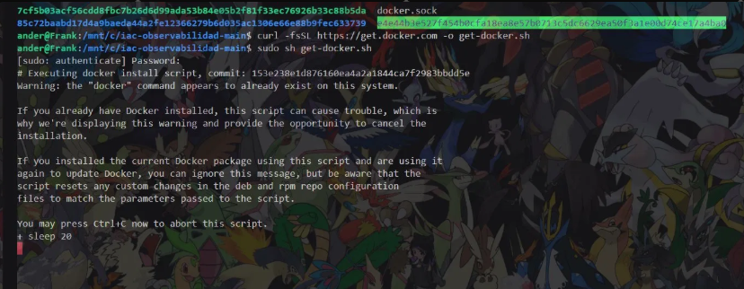
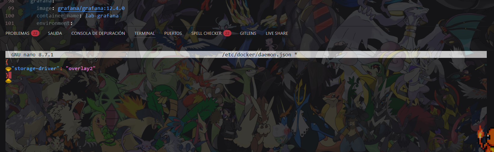
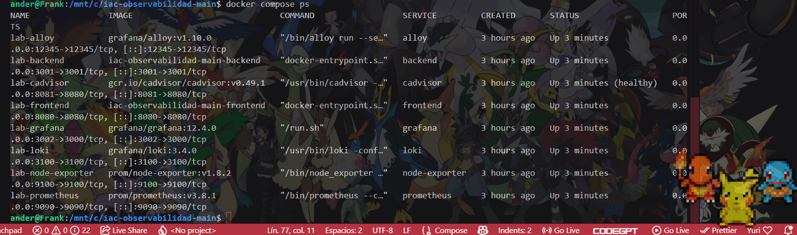

# **lab10-iac-Trelles_Diaz_Frank**
# ENTREGABLES DE RESPUESTAS E INSTRUCCIONES

## PREGUNTAS

## ¿Por qué necesitamos Loki además de Prometheus si ya tenemos /metrics?

Prometheus y Loki son necesarios porque las métricas nos dicen qué pasa, pero los logs explican el por qué. Mientras que Prometheus monitorea datos numéricos a través de `/metrics` para detectar anomalías en tiempo real y activar alarmas de inmediato, Loki se encarga de recolectar el texto detallado que la aplicación escribe línea por línea. Sin Loki, sabríamos que el sistema falla, pero no podríamos ver la causa raíz ni el mensaje de error exacto para solucionarlo rápidamente.

## ¿Qué ventaja aporta que las fuentes de datos de Grafana estén aprovisionadas como código y no creadas a mano?

La ventaja que aporta es que permite aprovisionar las fuentes de datos como código (IaC), en lugar de tener que crearlas a mano, lo cual garantiza que todo el entorno de monitoreo sea automático, rápido y libre de errores humanos. Al definir conexiones como Prometheus y Loki en archivos de configuración `.yaml`, se puede levantar toda la infraestructura con un solo comando y asegurar que los entornos de desarrollo y producción sean exactamente iguales. Además, al quedar todo registrado en el repositorio de Git, se mantiene un historial de cambios claro y se evita tener que volver a configurar las conexiones manualmente si el servidor se cae o se migra de máquina.

## El panel "CPU contenedor" y el panel "CPU host" pueden mostrar valores muy distintos. ¿Por qué? ¿Cuál usarías para alertar sobre una aplicación concreta?

Muestran valores distintos porque el "CPU contenedor" mide exclusivamente el uso de recursos del proceso aislado de la aplicación dentro de Docker, mientras que el "CPU host" mide la carga global de todo el sistema operativo de la máquina real. Para alertar sobre una aplicación concreta se debe usar obligatoriamente el CPU del contenedor, ya que de esta manera se aísla el comportamiento del backend y se evitan falsas alarmas causadas por procesos ajenos al servicio.

## ¿Qué diferencia hay entre el evaluation interval y el pending period de una alarma?

La diferencia principal es que el "evaluation interval" define cada cuánto tiempo Grafana analiza la métrica, mientras que el "pending period" es el tiempo de espera obligatorio que la infracción debe mantenerse para confirmar que no es una falsa alarma. Es decir, con la configuración usada en este laboratorio, Grafana revisa la CPU automáticamente cada 10 segundos según el evaluation interval definido, pero la CPU debe quedarse por encima del 50% de forma continua durante 30 segundos enteros antes de que la alarma cambie al estado de disparo "firing" y envíe la notificación automática al backend.

## INSTRUCCIONES

## 1. Clonar el repositorio

Clonar el repositorio y ejecutarlo desde la carpeta principal mediante una terminal basada en WSL (Ubuntu), debido a que algunos comandos de Docker no funcionan correctamente con el kernel de Windows.

```
git clone https://github.com/Fraanck18/lab10-iac-Trelles_Diaz_Frank.git
```

## 2. Levantar los contenedores

Para levantar los contenedores, colocar el siguiente comando:

```
docker compose up -d --build
```

### Problema 1: error de mount no compartido

Al intentar levantarlo, puede aparecer el siguiente error:

```
Error response from daemon: path / is mounted on / but it is not a shared mount
```

Esto sucede porque en WSL2 el mount raíz (`/`) es privado por defecto, y la opción `rslave` requiere que sea `shared`, lo que impide que contenedores como `node-exporter` propaguen sus volúmenes hacia el host, bloqueando su creación.

Para solucionarlo, en `docker-compose.yml`, dentro de `volumes`, eliminamos `,rslave`:

```yaml
# Antes
volumes:
    - /:/host:ro,rslave

# Después
volumes:
    - /:/host:ro
```

Luego, permitimos que los contenedores Docker vean y compartan los montajes del sistema host:

```
sudo mount --make-rshared /
```

Y volvemos a levantar el stack:

```
docker compose up -d --build
```

La solución funciona porque al montar `/` como `rshared` se permite la propagación de montajes entre el host y los contenedores, que es justamente lo que necesitaba `node-exporter` para crear su volumen sin errores.

### Problema 2: Docker no instalado o driver incorrecto

Si Docker no está instalado o usa el driver `overlayfs` en lugar de `overlay2` (requerido por cAdvisor v0.49.1), ejecutar:

```
curl -fsSL https://get.docker.com -o get-docker.sh

sudo sh get-docker.sh

sudo usermod -aG docker $USER

sudo service docker start
```



Verificamos la instalación:

```
docker compose version
```

Editamos (o creamos) el archivo de configuración del daemon:

```
sudo nano /etc/docker/daemon.json
```

```json
{
  "storage-driver": "overlay2"
}
```



Reiniciamos el servicio de Docker:

```
sudo service docker restart
```

Volvemos a aplicar el `rshared` y levantamos el stack:

```
sudo mount --make-rshared /

docker compose up -d --build
```

### Problema 3: conflicto de puertos con Grafana

Si el puerto `3000` ya está siendo usado por otra instancia de Grafana (por ejemplo, una instalación nativa en Windows), se puede verificar con:

```
cmd.exe /c netstat -ano | grep :3000

cmd.exe /c tasklist | grep <PID>
```

Para evitar el conflicto, cambiamos el puerto expuesto de Grafana en `docker-compose.yml`, por ejemplo a `3002:3000`, de forma que no se cruce con instancias levantadas directamente desde Windows.

### Problema 4: las métricas no aparecen en Prometheus / falta la etiqueta `name="lab-backend"`

Si al consultar en Prometheus no se muestran las métricas o el contenedor del backend no aparece con la etiqueta `name="lab-backend"`, bajamos los contenedores eliminando los volúmenes y los volvemos a levantar:

```
docker compose down -v

docker compose up -d --build
```

Verificamos que estén levantados:

```
docker ps
```



En Prometheus, vamos a **Status → Target health** para confirmar que todos los targets estén activos (`UP`), y ejecutamos la query del CPU del contenedor para confirmar que el `name="lab-backend"` ya es detectado.

## 3. Acceso a las aplicaciones

En el navegador, colocar `localhost` seguido de los siguientes puertos para acceder a las apps:

- Backend: `localhost:8080`
- Frontend: `localhost:3001`
- Grafana: `localhost:3000` (o `localhost:3002` si se cambió el puerto)
- Prometheus: `localhost:9090`
- cAdvisor: `localhost:9100`

## 4. Generar métricas y logs iniciales

Para iniciar con las métricas, ir al frontend y presionar "Saludar API" un par de veces para generar tráfico. Para obtener las métricas en formato Prometheus, colocar el endpoint `/metrics`:

```
localhost:8080/metrics
```

## 5. Creación de Dashboards

### CPU del contenedor de la aplicación

Configuración del panel:

- Fuente: Prometheus
- Tipo de visualización: Time series
- Unit: Percent (0-100)

PromQL:

```
sum(rate(container_cpu_usage_seconds_total{name="lab-backend"}[1m])) * 100
```

### CPU del host

Configuración del panel:

- Fuente: Prometheus
- Tipo de visualización: Time series
- Unit: Percent (0-100)

PromQL:

```
sum(rate(container_cpu_usage_seconds_total[1m])) * 100
```

Al generar carga, el consumo del CPU del contenedor del backend debe superar claramente el 50%, mientras que el CPU del host se mantiene en valores bajos, demostrando el aislamiento entre ambos paneles.

### Logs de aplicación (API + frontend)

- Fuente: Loki
- Tipo de visualización: Logs

```
{tier="application"} | json

{tier="application"} | json | level="level"   # Filtro por nivel (INFO, WARN, ERROR)
```

### Logs de infraestructura

- Fuente: Loki
- Tipo de visualización: Logs

```
{tier="infrastructure"}
```

## 6. Configuración de la alerta

Crear una alerta sobre el CPU del backend con la siguiente configuración:

- Query:

```
sum(rate(container_cpu_usage_seconds_total{name="lab-backend"}[1m])) * 100
```

- Condición: `IS ABOVE 50`
- Evaluation interval: 10 segundos
- Pending period: 30 segundos
- Carpeta y etiqueta: `severity = warning`

Cuando la CPU del contenedor se mantiene por encima de 50% durante menos de 30 segundos, la alerta queda en estado **pending**. Solo cuando la condición se mantiene de forma continua durante los 30 segundos completos, la alerta pasa al estado **firing** y dispara la notificación.

## 7. Cerrar el ciclo de la alarma

Crear un **Contact point** con integración de webhook, usando la siguiente URL:

```
http://backend:3001/alerts
```

Tras crearlo:

1. Dirigirse a **Notification policies**, editar la política por defecto y seleccionar el contact point creado, luego actualizar la política.
2. Editar la alerta creada en el paso anterior y, en el apartado de configuración de notificaciones, asociarla al contact point creado (reemplazando la opción "empty").

Para verificar el ciclo completo al aumentar la carga, usar los siguientes queries en los paneles de logs:

- En el panel de logs de aplicación, para ver las solicitudes que generan carga:

```
{tier="application"} | json | method = "POST"
```

- En el panel de logs de infraestructura, para ver las alertas recibidas por el webhook:

```
{tier="infrastructure"} |= "alert"
```

Opcionalmente, se puede crear un dashboard adicional que muestre los logs directos del backend usando:

```
{container="lab-backend"} |= "grafana_alert_received"
```

Esto permite confirmar en tiempo real que el webhook hacia `/alerts` recibe la petición HTTP POST (`"msg":"grafana_alert_received"`, `"alert_status":"firing"`), validando que la red interna de Docker, la lógica del webhook y la indexación de logs mediante Loki están correctamente integradas.

Al bajar la carga, la alerta vuelve al estado **resolved**, completando así el ciclo completo de la alarma (pending → firing → resolved).

## Explicación de los componentes

El stack de observabilidad funciona de manera integrada para capturar el comportamiento de la infraestructura y la aplicación en tiempo real. cAdvisor y Node Exporter actúan como recolectores iniciales, obteniendo las métricas de uso de hardware directamente desde los contenedores Docker y el sistema operativo host, respectivamente. Toda esta información numérica es recopilada periódicamente por Prometheus, que almacena las series temporales y evalúa las reglas de alerta configuradas (como el umbral de CPU). En paralelo, Loki se encarga de centralizar e indexar los logs de texto línea por línea que emite el backend de la aplicación. Finalmente, Grafana actúa como la capa visual unificada, conectándose a Prometheus y Loki para mostrar los datos en dashboards interactivos y gestionar el envío automático de notificaciones webhook cuando se dispara una alarma.